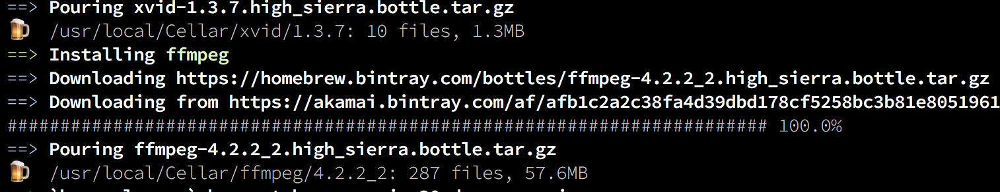
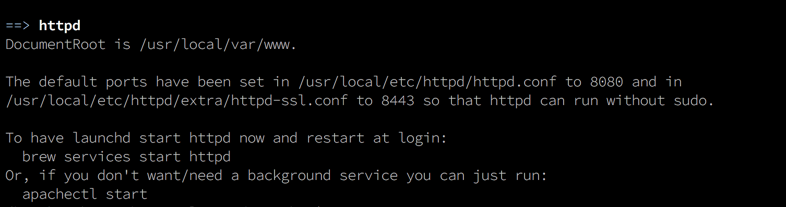
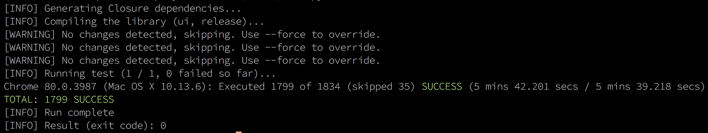
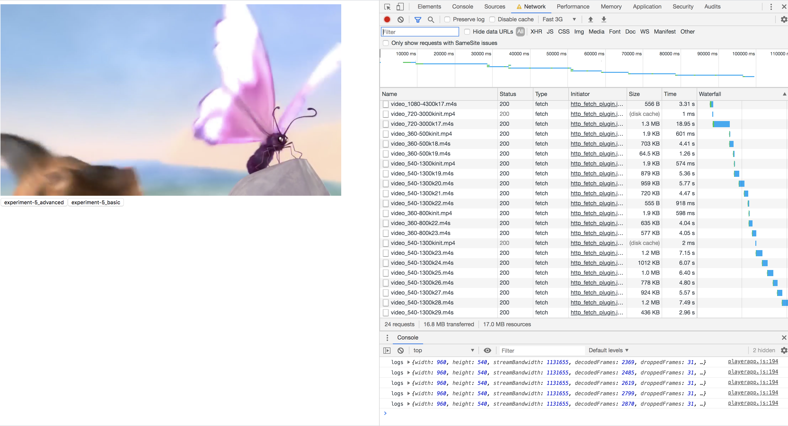

# Multi-media
Shaka player experiments

This repository contains all files used in IMS assignment.

All of my experiments were performed on Mac OS 10x version

This README explains, steps to 
1. Install the required softwares
2. Run and replicate the experiment carried out in this assignment.

## Installing ffmpeg

[ffmpeg][] is tool that helped me with video encoding. ffmpeg is a cross platform tool that helps with recording, converting and streaming audio and video files.

There are two ways to install ffmpeg
1. Through the source files that can be downloaded from the [download link][]
2. If brew is installed on the machine, then installing ffmpeg with brew is the easiest way.

I have used brew to install 

	$ brew install ffmpeg 

[ffmpeg]: https://www.ffmpeg.org/
[download link]: https://www.ffmpeg.org/download.html

Installation is successful, if following is seen.

# 

After the installation, make sure you check if you have the H264 encoder support.

	$ ffmpeg -formats | grep "H.264"

look for the following line in the terminal console

	$ DE h264            raw H.264 video

## Installing Shaka player

Shaka Player's [welcome page] has clear instructions on how to successfully install the player.

[welcome page]: https://shaka-player-demo.appspot.com/docs/api/tutorial-welcome.html

Following are the steps to follow.

### Prerequisites

#### Installing Git

	$ brew install git
 After the installation do the following to check if its successfully installed.
	$ git version
	$ git version 2.22.0

#### Installing Python 

Generally Mac OS comes with built in python. Check if its already installed by doing the following

	$ python --version
	$ Python 3.7.1

If python is not installed, then download the required version from the [download page]. Make sure python is either v2.7 or v3.5+

[download page]: https://www.python.org/downloads/

#### Installing java runtime environment JRE

To check if JRE is already installed on the machine, do the following,

	$ /Library/Internet\ Plug-Ins/JavaAppletPlugin.plugin/Contents/Home/bin/java -version

This should show something like the following

	$ java version "1.8.0_202"
	$ Java(TM) SE Runtime Environment (build 1.8.0_202-b08)
	$ Java HotSpot(TM) 64-Bit Server VM (build 25.202-b08, mixed mode)

If JRE is not installed then, download the JRE from [download page]. Make sure the JRE version is atleast v8+

[download page]: https://java.com/en/download/

#### Installing node js

Node js can be installed from the Node js [download page]

[download page]: https://nodejs.org/dist/v13.13.0/node-v13.13.0.pkg

Double click on the downloaded file and follow the instructions.

After installation, check if its installed sucessfully by doing the following.

	$ node -v
	$ v13.13.0

#### A local apache server

As per the Shaka player's website: A local web server is required because browsers place restrictions on applications from file:/// URLs.

[Apache server] can be installed by doing the following.

Check if the server in already installed and if installed and running, then stop it and remove it

	$ sudo apachectl stop
	$ sudo launchctl unload -w /System/Library/LaunchDaemons/org.apache.httpd.plist

Install apache with brew

	$ brew install httpd

End of successful installation should look something like the following

# 

After installation, start the service and check if it works

Run the following to start the server

	$ sudo brew services start httpd

Check if it works by lauching a browser and typing http://localhost:8080/

it should print "It works!"

[Apache server]: https://httpd.apache.org/

Now that we have all the Prerequisites, install shaka player from the source.

Please make sure, the shaka player project is cloned or downloaded under src/ folder of this project. For the player to work, the shaka player project needs to be in the same folder as the src files.

	$ cd src/
	$ git clone https://github.com/google/shaka-player.git
	$ cd shaka-player

Compile the libraries

	$ python build/all.py

compilation compiles bunch of modules

	$ [INFO] Compiling the library (ui, debug)...
	$ ...
	$ [INFO] Compiling the library (compiled, debug)...
	$ ...
	$ [INFO] Compiling the demo app (debug)...
	$ ...
	$ [INFO] Compiling the receiver app (debug)...
	$ ...
	$ [INFO] Compiling the library (ui, release)...
	$ ...
	$ [INFO] Compiling the library (compiled, release)...
	$ ...
	$ [INFO] Compiling the demo app (release)...
	$ ...
	$ [INFO] Compiling the receiver app (release)...

I have also noticed bunch of Warnings after every module compilation.

Run the tests

find the available browsers by running the following

	$ ./build/test.py --browsers help

This should print available browsers something like the following

	$ Available browsers:
	$ ===================
	$ Chrome
	$ ChromeHeadless
	$ Safari

Finally, run the tests 

	$ ./build/test.py --browsers Chrome

Successful tests should look like the following.

# 

## How to run an experiment.

Resources required to run an experiment are stored in AWS. Those resources are made public by updating the CORS configuration.
These are essential resources used by Shaka player.

To run an experiment,

Make sure, we have access to resources on AWS by downloading the following files

1. [mpd file]
2. [original video file]

[mpd file]: https://ims-assignment.s3.eu-west-2.amazonaws.com/outputmulti_dash.mpd
[original video file]: https://ims-assignment.s3.eu-west-2.amazonaws.com/bbbsource.mp4

The  video file is referenced and loaded in [player.html](src/player.html) and the mpd file is referenced in [playerapp.js](src/playerapp.js)

lauching the player.html in chrome starts the video and following is the screenshot of a running video.

# 

There are 2 buttons in the html file that can be seen in the above screenshot. 
Clicking on these buttons will download 2 csv files
1. [basic csv](src/experiments/experiment-1_basic.csv)
2. [advanced csv](src/experiments/experiment-1_advanced.csv)

These csv files capture the statistics required for Quality metrics. Stats are provided by the shaka player for every network request. 
csv files generated out of experiments are analyzed and plots are plotted using following python notebook

1. [notebook](ims_assignment_notebook.ipynb). 

## How to generate an mpd file

Mpd files and source files used in experiments are already generated automatically and uploaded on AWS. However, to generate a new Mpd file, Mp4Box is used.

Mp4Box can be installed by following instructions from its [site]. 

[site]: https://github.com/gpac/gpac/wiki/GPAC-Build-Guide-for-OSX

After installation of Mp4Box, run the following commands

	$ ffmpeg -i bbbsource.mp4 -c:v libx264 -preset slow -crf 22  -x264opts 'keyint=48:min-keyint=24:no-scenecut' -b:v 800k  -maxrate 1600k -bufsize 3200k -pass 1 -r 24 -s 640x360 -c:a copy output1_360p.mp4
	$ MP4Box -dash 4000 -frag 4000 -rap -segment-name video_360-500k "output_360p-500k.mp4"  -- mpd file

bbbsource.mp4 file is [original video file] mentioned above. Encoding is done with [H.264] encoder. 

[original video file]:https://ims-assignment.s3.eu-west-2.amazonaws.com/bbbsource.mp4
[H.264]: https://trac.ffmpeg.org/wiki/Encode/H.264 

